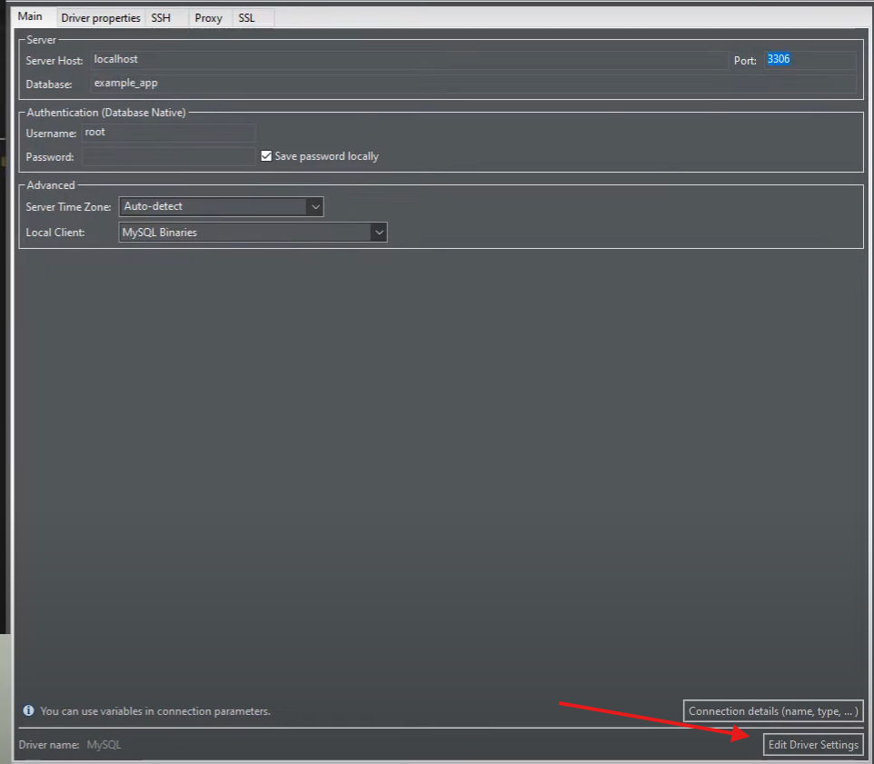
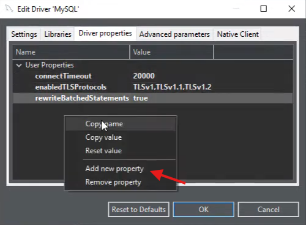
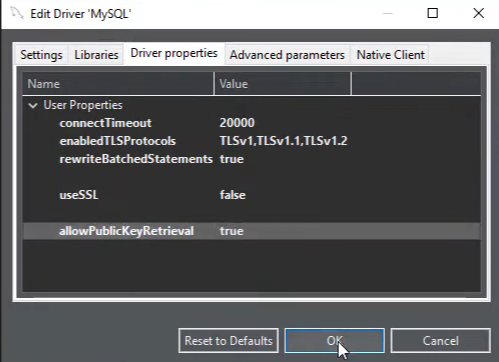
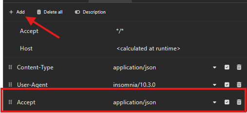

# Desafio Técnico - Guia de Instalação, Configuração e Uso

Este guia descreve os passos necessários para instalar, configurar e executar o projeto disponível no repositório [Desafio-Tecnico](https://github.com/pedroamaral01/Desafio-Tecnico).

## Pré-requisitos

- **Docker** e **Docker Compose** instalados.
- Cliente de banco de dados, como **DBeaver** ou outro similar.
- Testar as rotas com **Insomnia** ou outro similar.

## Instalação e Configuração

### 1. Clone o repositório do projeto:

   ```bash
   git clone https://github.com/pedroamaral01/Desafio-Tecnico.git
   cd Desafio-Tecnico
   ```

### 2. Copie o conteúdo de `.env.example` e cole em `.env`:

### 3. Suba o ambiente Docker usando o Laravel Sail:

   ```bash
   ./vendor/bin/sail up
   ```

### 4. Execute as migrações para criar as tabelas no banco de dados:

   ```bash
   ./vendor/bin/sail artisan migrate
   ```

### 5. Configuração do Banco de Dados: Para acessar o banco de dados, configure um cliente como o DBeaver, utilizando as credenciais definidas no arquivo `.env`.

   Importante: caso utilize o DBeaver, edite as configurações no driver MySQL ao conectar:
   - `"useSSL"` ⇒ `false`
   - `"allowPublicKeyRetrieval"` ⇒ `true`

   

   

   

### 6. Configuração dos Headers para Testar Erros de Requests:

   Para testar os erros de requests das rotas, é necessário adicionar a opção `Accept: application/json` no header de cada rota. Isso garante que a API retorne as respostas no formato JSON.

   

## Rotas da API

1. **Criar Conta**
   - Método: POST
   - Endpoint: `http://localhost/api/contas`
   - Parâmetros de Exemplo:
     ```json
     {
         "nome_titular": "exemplo", 
         "cpf": "11111111111" 
     }
     ```

2. **Realizar Depósito**
   - Método: PUT
   - Endpoint: `http://localhost/api/operacoes-bancarias/deposito`
   - Parâmetros de Exemplo:
     ```json
     {
       "contas_id": "1", 
       "valor": "100.00", 
       "moeda": "EUR"
     }
     ```

3. **Consultar Saldo**
   - Método: GET
   - Endpoints Disponíveis:
     - Para visualizar o saldo por moeda:
       ```bash
       http://localhost/api/operacoes-bancarias/saldo/{contas_id}
       ```
       Exemplo:
       ```bash
       http://localhost/api/operacoes-bancarias/saldo/1
       ```
     - Para visualizar o saldo convertido para uma moeda específica:
       ```bash
       http://localhost/api/operacoes-bancarias/saldo/{contas_id}/{moeda}
       ```
       Exemplo:
       ```bash
       http://localhost/api/operacoes-bancarias/saldo/1/BRL
       ```

4. **Realizar Saque**
   - Método: PUT
   - Endpoint: `http://localhost/api/operacoes-bancarias/saque`
   - Parâmetros de Exemplo:
     ```json
     {
       "contas_id": "4",
       "valor": "1.40",
       "moeda": "CAD"
     }
     ```

## Testes

### 1. Execute as migrações para o banco de dados de teste:

   ```bash
   ./vendor/bin/sail artisan migrate --env=testing
   ```

### 2. Execute os testes:

   ```bash
   ./vendor/bin/sail artisan test
   ```

### 3. Executando testes específicos:

   Em cada arquivo presente na pasta `tests`, há comandos para testar o arquivo completo ou cada função separadamente. Por exemplo, para testar o arquivo `ContaIdRequestTest` ou uma função específica dentro dele, você pode usar os seguintes comandos:

   - Para testar o arquivo completo:
     ```bash
     ./vendor/bin/sail artisan test --filter=ContaIdRequestTest
     ```

   - Para testar uma função específica:
     ```bash
     ./vendor/bin/sail artisan test --filter=ContaIdRequestTest::test_contas_id_obrigatorio_null_falha
     ```
